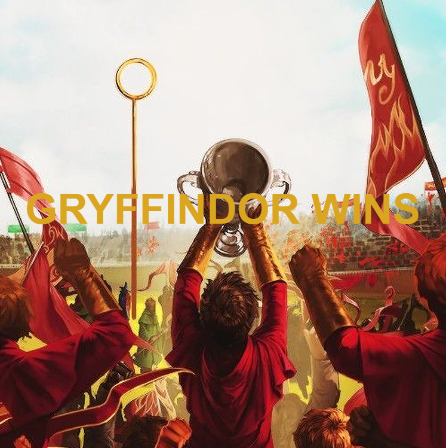

# Object Oriented Programming Game Project

# Modifications

- Increased the size of the gameboard
- Changed img for background, player, and enemies
- Added a soundtrack to the game
- Added a start button to the game
- Added a hit counter: the game is over if the player is hit 3 times
- Added a score counter: difficulty level increases as the score increases & the player wins at a certain score
- Player is brought back to the start page after losing the game 

# Netlify

https://quidditch-match.netlify.app/